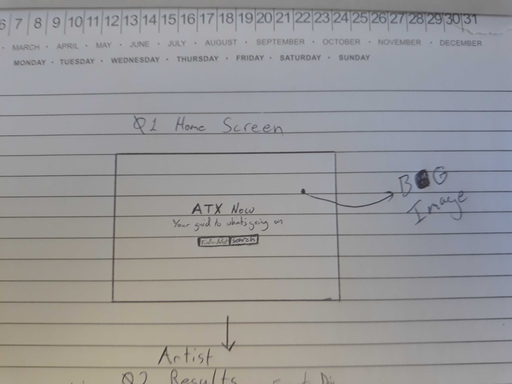
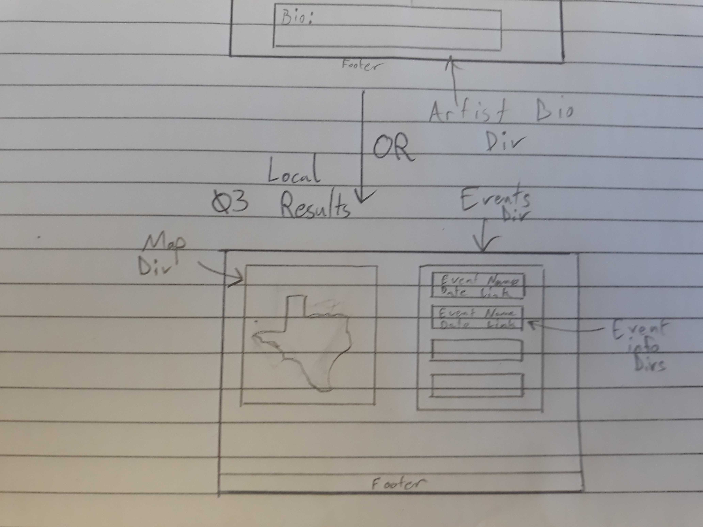
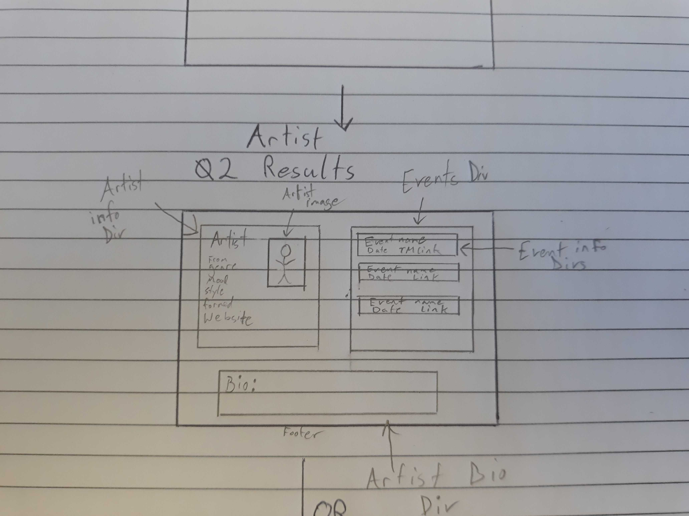

# ATX Now
## Title
ATX Now

## Description
A guide to events happening in the Austin Area and with your favorite artists. Provides
local concert listings or allows the user to search for a specific artist to see info and concert listings.

## User Story
As a person who likes live music, I want to see my options for live music in the area I will be, so that I can go to live music in town.
As a person who likes music, I want to see information about my favorite artists and when they are coming to town.
As a person who wants to go to a concert, I want to buy tickets to shows.

## Wirefame

## APIs to be used
### Server Side APIs
1. TheAudioDB - Get information on specifc artists (name, genre, discography, top tracks)
2. Ticketmaster - Get information on events, ticket listings
3. geoIpLookup - Get the user's current location based off IP address

### Third Party APIs
1. axios - ajax requests
2. leaflet - for displaying maps

## Task Breakdown
Josh
1. bulma / layout
2. leaflet

Kevin
1. leaflet
2. ticketmaster API 

Z
1. ticketmaster API
2. bulma / layout